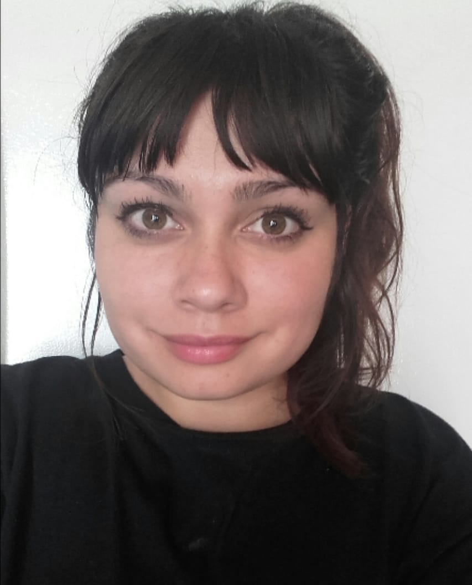

<b> Magalí Orellana </b> 

Hola, mi nombre es Magalí Orellana tengo 27 años, soy estudiante de la tecnicatura en programación en la Universidad Nacional de Hurlingham desde el año 2021.

Además soy estudiante del conservatorio de música de Morón **Alberto Ginastera**, me apasiona tocar el piano, encontré tambien dentro de la carrera, una conexión entre la música y la programación que a medida que avanzo lo voy fusionando.

Durante el verano de 2022/2023 hice un curso de desarrollo web, donde me di cuenta que me gustaba el diseño y la programación Front-End, en mis tiempos libres busco aprender nuevos lenguajes de programación.

**Hobbies**:
- Tocar el piano.
- Aprender nuevos lenguajes.
- Ordenar y mantener las cosas en orden.
- Salir a pasear.
- Pasar tiempo con mi gata Sally, que tiene 1 año.

